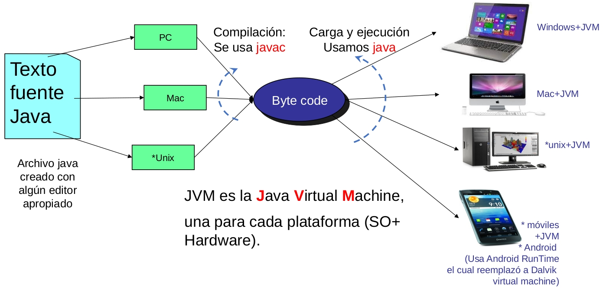

# ELO329 - Diseño y Programación Orientados a Objetos
## Introducción a Java
Agustín González
Patricio Olivares

---

# Java: Motivaciones  de su origen

Por los años 90 los desarrolladores de Java buscaban ofrecer lenguaje independiente de:
- Tipo de computador
- Sistema operativo
- Sistema de ventanas (win32, Motif, etc.)
- Obs: Cuando Java aparece (1995) no existía Qt (herramienta para desarrollar software gráfico en C++ para múltiples plataformas).
- C++ permite el uso de punteros, muy útiles para electrónicos y telemáticos, pues corresponde a direcciones de la memoria física. Como éstos generaban dificultades para muchos, Java los elude.
- Java hace un manejo de memoria que libera al programador de esa preocupación. No hay "fugas de memoria" o "memory leaks"

---

# Independiente del Computador y del Sistema Operativo

- Esto se logra por el uso de una *Máquina Virtual Java (Java Virtual Machine).*
- Una máquina virtual es una abstracción de una máquina real. La máquina virtual es generada por software.
- ¿Han usado programas emuladores de consolas de juegos?
- ¿Han usado programas emuladores de PC dentro de un PC? Así podemos tener varios Sistemas operativos corriendo concurrentemente en la misma máquina. Ej: Vmware, VirtualBox.
- Este concepto también es aplicable a sistemas operativos donde es posible crear la apariencia de tener varias máquinas independientes (jaulas o jails)

---

# Java Virtual Machine (JVM)


- Para cada combinación hardware+SO se ha creado una máquina virtual Java (es un programa más).
- Un programa compilado Java (byte code) corre "igual" en todas las máquinas virtuales.
- Ver: [https://www.oracle.com/java/](https://www.oracle.com/java/).

---

# Edición, compilación y ejecución


---

# Trabajando con Java

- Definición e instalación de Java y Editor de texto.
- Java
    - Bajar Java SE (Estándar Edition) desde [https://www.oracle.com/java/](https://www.oracle.com/java/).
    - Para Linux también lo puede instalar desde un repositorio (apt-get, yum, pacman, etc.)
    - La instalación varía según su SO. Cosas a tener en cuenta:
        - Bajar archivo de instalación
        - Seguir los pasos para su ejecución
        - Ejecutar una consola y probar comando `$ java --versión`
        - Según la respuesta otras acciones podrían ser necesarias; por ejemplo, la configuración de la variable PATH

---

# Trabajando con Java

- Definición e instalación de Editor de texto.
- Editor:
    - Para cosas simples usar alguno de su conveniencia; por ejemplo, [sublime](https://www.sublimetext.com/index2).
    - Una vez que sabe cómo compilar y correr usando la consola, se sugiere usar un ambientes integrados de Desarrollo (IDE) como:
        - [Visual Studio Code](https://code.visualstudio.com/)
        - [Intelli J](https://www.jetbrains.com/es-es/idea/)
        - [jGrasp](https://www.jgrasp.org/)
        - [Eclipse](https://eclipseide.org/)
        - [Netbeans](https://netbeans.apache.org/front/main/index.html)
    - Un buen editor debería ayudar a indentar su programa, colorear palabras reservadas, etc.
    - **No usar notepad** o similar.

---

# Mi primer programa

- **Creación de programa**: Con editor crear programa con extensión java (`FirstSample.java`).
- **Compilación**: vía línea de comandos
```bash
$ javac FirstSample.java
```
La salida será uno o más archivos `.class`. Esta es la versión del programa en código byte (*byte code*).

---

# Mi primer programa

- **Ejecución**: 
```bash
$ java FirstSample
```
Notar que java es el programa que corremos para crear la máquina virtual donde el "byte code" (`.class`) es ejecutado. Equivale a una interpretación en la máquina real.
- Para aprender más, ver [Documentación JDK 21](https://docs.oracle.com/en/java/javase/21/) (Java Development Kit).

---

# Componentes de Java

- Java tiene muchas [componentes](http://manuales.elo.utfsm.cl/manuales/jdk-8u40/index.html) (componentes para Java versión 8)
- Nosotros usaremos algunas, tales como : java, javac, javadoc, JavaFX, etc.